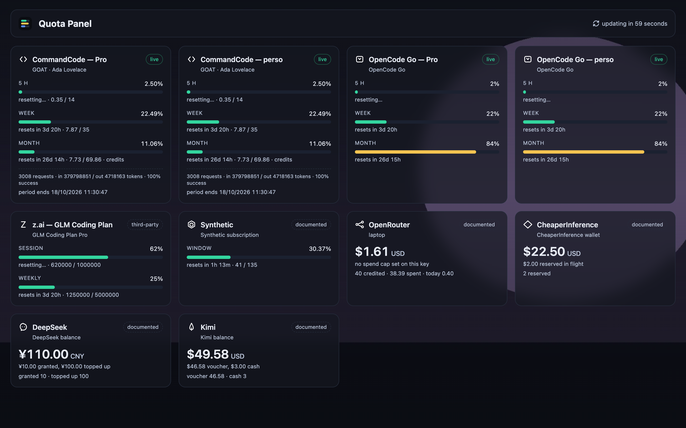
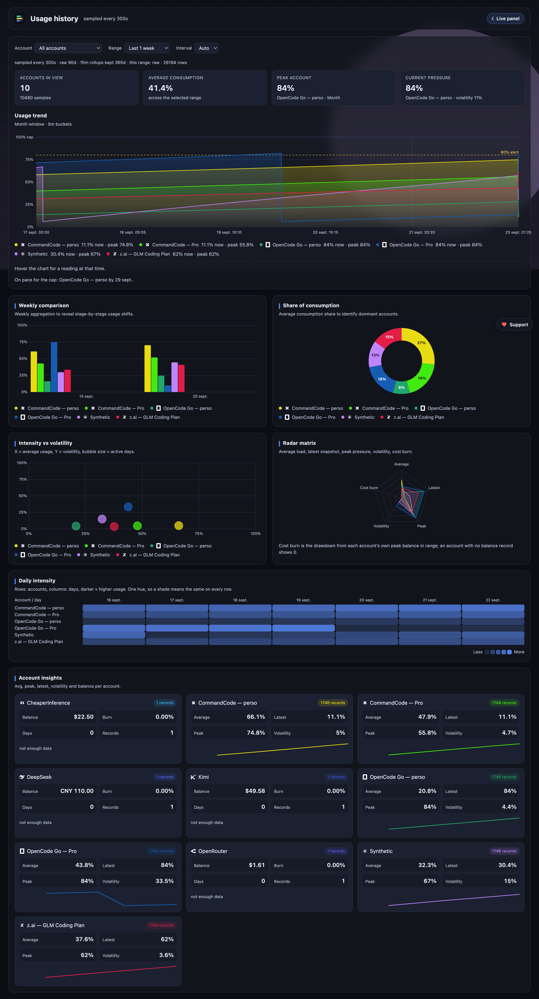

<p align="center">
  
</p>

<h1 align="center">Quota Panel</h1>

<p align="center">A small read-only dashboard that shows <b>how much of your AI coding subscription is left</b>, right now, for every account you have, with a live countdown to each reset.</p>

<p align="center">
  <a href="https://github.com/realAbitbol/quota-panel/actions/workflows/ci.yml"></a>
  <a href="https://github.com/realAbitbol/quota-panel/pkgs/container/quota-panel"></a>
  <a href="LICENSE"></a>
  <a href="https://www.python.org/"></a>
</p>





*Screenshots use synthetic data.*

Any number of accounts, any mix of providers — each gets its own card. An account whose credential is
missing or refused renders as an error card and never takes the panel down.

### Supported providers

| | `provider` | Card | Reports |
|---|---|---|---|
|  | `commandcode` | window | 5 h / weekly / monthly percent |
|  | `opencode_go` | window | rolling / weekly / monthly percent |
|  | `zai` | window | session / weekly / web-search quota |
|  | `synthetic` | window | request allowance percent |
|  | `openrouter` | balance | credit balance; percent only if the key has a spend limit |
|  | `cheaperinference` | balance | wallet balance |
|  | `deepseek` | balance | balance in CNY or USD |
|  | `kimi` | balance | available / voucher / cash balance |

## Install

```bash
curl -o accounts.json \
  https://raw.githubusercontent.com/realAbitbol/quota-panel/main/accounts.example.json
$EDITOR accounts.json            # one entry per account

docker run -d \
  --name quota-panel \
  --restart unless-stopped \
  -p 127.0.0.1:8080:8080 \
  -v "$PWD/accounts.json:/config/accounts.json:ro" \
  -v quota-panel-data:/data \
  ghcr.io/realabitbol/quota-panel:latest
```

Write the config first: the container polls nothing without it, and a bind mount onto a missing path
leaves a *directory* in its place. Then open <http://localhost:8080>.

There is no built-in login and the page shows labels, plan names and spend, so the port stays on
loopback — put it behind an authenticating proxy. A LAN dashboard (Homepage, Dashy, Glance) is the
exception: give it the published port on the LAN interface, or list it in the proxy's bypass rules.

A hardened `docker-compose.yml` and a build-from-source path are in
[docs/configuration.md](docs/configuration.md).

## Configuration

Minimal `accounts.json` (mounted read-only at `/config/accounts.json`):

```json
{
  "accounts": [
    { "id": "cc-work", "provider": "commandcode", "label": "CommandCode — work", "token": "user_…" },
    { "id": "or-main", "provider": "openrouter",  "label": "OpenRouter",         "token": "sk-or-…" }
  ]
}
```

`provider` is one of the table above; `label` defaults to `id`; the key goes in `token`
(`token_env` holds the variable's *name*, not the key).

Every field, the environment variables, the full endpoint list, the Homepage tile, and the usage
history store are in **[docs/configuration.md](docs/configuration.md)**.

## Usage history

`/history` charts usage over time from one SQLite file — hand-rolled SVG, no chart library. It ships
on; the store config and retention are in [docs/configuration.md](docs/configuration.md#usage-history).

## Security

* Read-only and outbound only: a `GET` per provider call, one artwork fetch at startup, and — only
  when `alert_url` is set — a `POST` per alert. No write path.
* Credentials are read at startup, never logged, and sent only to the provider that owns them.
* No built-in login: keep the port on loopback, run it behind an authenticating proxy, and keep an
  inline-token config at mode `600`/`640` owned by uid 10001 (`chown 10001 accounts.json`).
* The container runs unprivileged (uid 10001); `docker-compose.yml` adds a read-only rootfs,
  `cap_drop: ALL` and `no-new-privileges`. Static serving containment-checks every path.

## Development

```bash
cp accounts.example.json accounts.json
python3 app.py --check                  # one poll, prints JSON, non-zero if any account is not ok
PORT=8080 python3 app.py
python3 tests/smoke.py                  # boots the app and exercises the HTTP surface
python3 tests/history.py                # the optional store: config, sampling, rollups, /api/history, alert log
python3 tests/balance.py                # registry, balance adapters, error branches
python3 tests/background.py             # artwork shrink (needs Pillow)
python3 tests/screenshot.py             # renders the real pages in Chromium and re-shoots docs/screenshot.png + docs/history.png
python3 tests/tab_switch.py             # a burst of tab switches must keep refreshing
QUOTA_POLL_SECONDS=10 python3 tests/cadence_soak.py   # the header's countdown must not decay
```

Every suite talks to a local stub instead of a provider, so they run offline and spend no quota. CI
runs them in real Chromium, then builds `linux/amd64` + `linux/arm64` and pushes to GHCR from `main`
and `v*` tags. A release is a tag.

## If it does not work

**`no account has a credential configured`, every card is an error.** A key was written into `token_env`. Move it to `token`.

**Docker created a directory where `accounts.json` should be.** The bind mount pointed at a missing path. Remove the directory, write the file, start again.

**One card says the provider rejected the key.** `401` is a bad or revoked key; `403` is usually a valid key missing a scope or a plan. `python3 app.py --check` gives the same answer without the UI.

The rest — permissions after moving host, the missing wallpaper, the history store — are in
[docs/configuration.md](docs/configuration.md#troubleshooting).

## Limits

* No token refresh: an expired key is reported as `auth_error` until you re-mint it and update the config.
* Polling is sequential: comfortable to a few dozen accounts.
* Nothing is inferred from a missing field: an amount the provider did not report renders as an error, never as `0.00`.

## License

MIT, see [LICENSE](LICENSE).

The container image installs [Pillow](https://python-pillow.org/) (MIT-CMU) for the artwork resize. The header marks are [Font Awesome Free](https://fontawesome.com/) 7.3.1 solid icons, inlined as SVG paths: CC BY 4.0, Copyright Fonticons, Inc. No icon font or CDN stylesheet is fetched.
